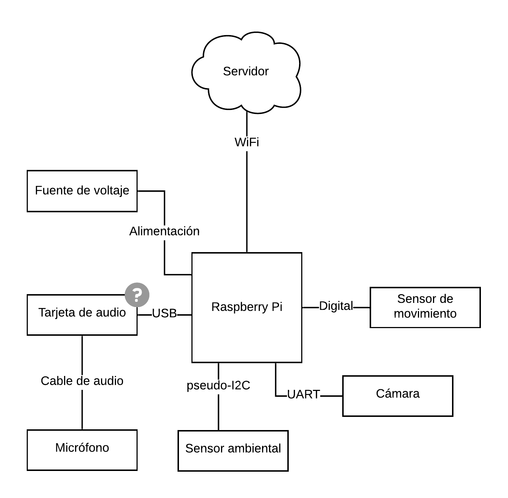

# raspi-forest-station

Repositorio del código para usar una Raspberry Pi como estación de recolección de datos para el Bosque Protector Prosperina. Funcionalmente equivalente a [SensoresServicio](https://github.com/rfcx-espol/SensoresServicio), pero usa una Raspberry Pi en lugar de un smartphone Android y un Arduino Mega.

## Estructura

El código está separado en los siguientes scripts:

* `raspi_camera.py`: Lee el sensor de movimiento, captura imágenes de la cámara en cada transición positiva del pin del sensor de movimiento (cuando pasa de LOW a HIGH), guarda las imágenes en la tarjeta SD y una referencia a las imágenes en la base de datos SQLite.
* `sensirion.py`: Lee el sensor ambiental una vez, guarda los datos en la base de datos SQLite y termina. Por lo tanto, debe invocarse repetidamente para leer los datos.
* `sendtoserver.py`: Lee la base de datos SQLite y envía los datos que estén guardados allí al servidor. Una vez que se confirma que una medición ha llegado con éxito al servidor, la elimina de la base de datos.

Aparte, hay algunas utilidades:

* `pirtest.py`: Permite probar el sensor de movimiento. Imprime dos mensajes cuando se detecta una transición positiva y negativa.
* `showdb.py`: Imprime los contenidos de la base de datos y termina. Permite verificar que los datos estén siendo guardados en la DB.
* `cleardb.py`: Vacía la base de datos.
* `getid.py`: Aún no usado. Permite obtener un indicador único para la Raspberry que se podría usar como Station ID (específicamente, es el [serial del CPU Broadcom](https://www.raspberrypi-spy.co.uk/2012/09/getting-your-raspberry-pi-serial-number-using-python/) soldado en la Raspberry).

## Conexiones

* La cámara se conecta a los pines 4, 6, 8 y 10 de la Raspberry (alimentación + serial).
* El sensor ambiental se conecta a los pines 1 y 14 para alimentación, y 12 y 16 para comunicación.
* El sensor de movimiento se conecta a los pines 2 y 20 para alimentación, y 18 para comunicación.

Para los sensores usados actualmente, los colores de los cables y los conectores siguen la tabla:

| Dispositivo   | Función   | Pin de conector   |  Color de cable   | Pin de Raspberry  |
| ------------- | --------- | ----------------  | ---------------   | ----------------- |
| Cámara        | 5V        | 4                 | Rojo              | 4                 |
| Cámara        | GND       | 3                 | Negro             | 6                 |
| Cámara        | RX        | 2                 | Verde             | 8                 |
| Cámara        | TX        | 1                 | Blanco            | 10                |
| Sensor ambiental | 3.3V   | 4                 | Rojo              | 1                 |
| Sensor ambiental | GND    | 3                 | Verde             | 14                |
| Sensor ambiental | ???    | 2                 | Azul              | 12                |
| Sensor ambiental | ???    | 1                 | Amarillo          | 16                |
| Sensor PIR    | GND       | 1                 | No aplica         | 20                |
| Sensor PIR    | SIG_OUT   | 2                 | No aplica         | 18                |
| Sensor PIR    | 5V        | 3                 | No aplica         | 2                 |

## Instrucciones de instalación

1. Ejecutar `sudo apt-get update` y `sudo apt-get upgrade`

1. Ejecutar `sudo apt-get install libsqlite3-dev`

1. Ejecutar `sudo raspi-config` y activar el puerto serial

1. Ejecutar `pip3 install requests pysqlite pi-sht1x pyserial`

1. Editar `/boot/config.txt` y agregar la línea `dtoverlay=pi3-miniuart-bt` al final para [reasignar el periférico UART de la Raspberry](https://www.briandorey.com/post/raspberry-pi-3-uart-overlay-workaround) al puerto serial de la cámara (el miniUART no tiene suficiente velocidad)

1. Copiar los scripts de Python del repositorio a la carpeta `/home/pi`, hacerlos ejecutables con `sudo chmod u+x *.py`  

1. Configurar los scripts para que se ejecuten en el arranque con `crontab -e`, y agregar al final (después de los comentarios):

    @reboot sleep 10; /home/pi/sendtoserver.py &> /dev/null  
    @reboot /home/pi/raspi_camera.py &> /dev/null  
    \* \* \* \* \* /home/pi/sensirion.py &> /dev/null  

1. Reiniciar la Raspberry Pi

1. Verificar que los scripts estén ejecutándose con `ps -axf`

1. Si los scripts se inician exitosamente, se iniciarán automáticamente cada vez que la Raspberry arranque. Por lo tanto, lo único que habría que hacer es alimentarla con 5V.

## Funcionalidades

### Funcionalidades completas

* Comunicación con sensor ambiental y captura de datos por intervalo (actualmente 1 captura por minuto)
* Comunicación con sensor de movimiento
* Comunicación con la cámara y captura de datos cuando se detecta movimiento
* Persistencia de datos en base de datos SQLite (hasta que sean enviados)
* Envío de datos al servidor

### Funcionalidades por desarrollar

* Captura de audio (no hay interfaz de audio USB)
* Envío de audio a servidor
* Identificar la estación con un ID real (por ahora se usa un ID fijo en el código)

### Bugs, limitaciones y posibles mejoras

* Verificar qué ocurre si la cámara se desconecta (es posible que el proceso de la cámara se detenga)
* Cambiar los procesos a un monitor de procesos que los reinicie si se detienen (por ejemplo, [daemontools](http://cr.yp.to/daemontools.html))
* Confirmar que los datos no se eliminen de la base de datos hasta que hayan sido transmitidos al servidor
* El sensor de movimiento es demasiado sensible y se activa constantemente, aunque no haya movimiento en su campo de visión. Revisar si es posible reducir la sensibilidad.
* En principio, SQLite emplea [locks](https://sqlite.org/lockingv3.html) para garantizar que los accesos a una misma DB desde diferentes procesos no causen problemas. En este caso, tres procesos escriben a  la DB, tal vez simultáneamente. Confirmar que no se causen bugs de concurrencia.